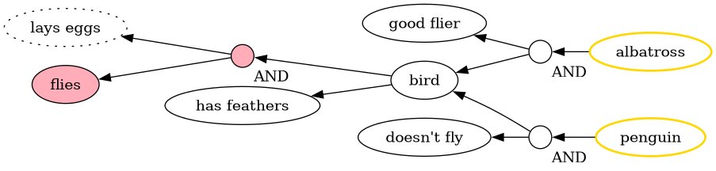

# Expert system

This is an expert system which functions like Akinator:
you think of a character (that the system knows about),
answer a series of questions
and the system determines the character based on your answers.

It also has an "encyclopedia" mode, in which you pick a character
and it tells you what facts can be used to deduce it.

# Usage

Set up a venv and install deps:
```sh
python3 -m venv .venv
source .venv/bin/activate
python3 -m pip install -r requirements.txt
```

Run the web server from inside the `src/` directory:
```sh
python -m expert_system.app.app
```
It should be running at http://127.0.0.1:5000 (check the output).

Run the tests:
```sh
pytest -s expert_system/goal_tree.py
```

# Report

This project was done for a uni lab.
Following is the report I wrote for it.

# Table of Contents

1.  [Task 1 & 2: Goal tree](#orgd0c92e6)
    1.  [Goal tree representation](#org3faa756)
    2.  [My goal tree](#org24e33a6)
2.  [Task 3: Forward chaining](#org135c280)
    1.  [Modus ponens](#orgc6e3e13)
    2.  [Pruning nodes](#org8cddee9)
    3.  [Exclusive groups](#org6c8b1d0)
    4.  [Guaranteed facts](#orgf2ebbbc)
    5.  [Everything put together](#org678e613)
3.  [Task 4: Backward chaining](#orge5ffc00)
4.  [Task 5: Generating questions](#org616e47e)
5.  [Task 6: Wrap it up in an interactive system](#orgbac43e2)
6.  [Task 7: human-readable questions](#org5f8b81b)
7.  [Conclusion](#org76451df)
8.  [Bibliography](#orgfff4349)

This report is best viewed in its HTML form, inside the source code archive.

The code in the report will assume the following imports.
The library `expert_system` is the code I wrote for this lab.

    from frozendict import frozendict
    from expert_system.goal_tree import GoalTree
    from expert_system.draw_goal_tree import render_DAG
    from expert_system.spongebob_rules import rules
    from expert_system.nlp import sentence_to_question


<a id="orgd0c92e6"></a>

# Goal tree and rules

In the MIT lab, they used a list of lists to represent IF-THEN rules:

    IF( AND( '(?x) has feathers' ),     # Z3
        THEN( '(?x) is a bird' )),
    
    IF( AND( '(?x) flies',              # Z4
             '(?x) lays eggs' ),
        THEN( '(?x) is a bird' )),

For example, the following rules:

    IF has feathers THEN bird;
    IF flies AND lays eggs THEN bird;

I chose a more idiomatic representation for the IF-THEN rules:
a dictionary that maps facts to a list of sets
where the elements of a set are AND-ed together.

For example, the above rules are expressed in the following way:

    example_rules = {"bird": ({"can fly", "lays eggs"}, {"has feathers"}),
                     "tiger": ({"has claws"},)}


<a id="org3faa756"></a>

## Goal tree representation

I chose to represent the goal tree (aka "and-or tree")
with a directed acyclic graph (DAG) data structure.
A DAG is like a tree, but it can have multiple roots,
and a node can have multiple parents.

Note that we can't have arches in an and-or tree,
so I decided to represent the AND operation using a separate node.
Thus, there are two kinds of nodes in my representation: **Fact nodes** and **And nodes**.

The rules are transformed into a DAG by constructing a `GoalTree` object like this:

    example_gt = GoalTree(example_rules)

The `GoalTree` object contains the constructed DAG object in the `dag` field.
There is a `DAG` class with a pretty simple interface:

-   `vertices()`
-   `add_vertex(*vertices)`
-   `add_edge(v_from, *v_to)`
-   `remove_edge(v_from, v_to)`
-   `vertex_size()`
-   `edge_size()`
-   `successors(vertex)`
-   `predecessors(vertex)`
-   `indegree(vertex)`
-   `outdegree(vertex)`

You can draw the goal tree DAG using `render_DAG` which uses the [graphviz](https://graphviz.org/) library:

    render_DAG(example_gt.dag, fn="example")


An And node is drawn as a circle with the label "AND" below it,
A Fact node is drawn as an ellipse with the fact string inside.

Notice how the roots nodes (hypotheses) are on the right,
whereas the leaf nodes (facts) are on the left.
There arrows are pointing from the parents to the children, which is [the more common notation](https://en.wikipedia.org/wiki/And%E2%80%93or_tree).

This diagram's interpretation is exactly the same as that of an and-or tree,
with the addition that the truth of an And node is equal to the logical `AND` of the values of all its children.
Conversely, the truth of a Fact node is equal to the logical `OR` of the values of all its children.

A DAG with this interpretation is perfect for representing an A-or tree:

-   it can have multiple hypotheses (roots)
-   a fact can be present in multiple antecedents (multiple parents)

The strings for the intermediate facts don't matter too much since the user doesn't see them,
however the facts will be later transformed into questions according to specific rules,
and they all have a similar forms: `PREDICATE + SUBJECT`, for example "has feathers".
I decided not to use variables in the rules because they are unnecessary for this lab,
since there is only ever a single subject.


<a id="org24e33a6"></a>

## Spongebob goal tree

Here is how I defined the rules for identifying characters from the show "Spongebob Squarepants":

    spongebob_rules = {
        "Spongebob": ({"sponge", "has a square head", "has square pants",
                       'wears a suit', 'is male'},),
        "Stanley": ({"sponge", "has a square head", "has tall body",
                     'wears a suit', 'is male'},),
        "sponge": ({"is yellow", "has holes"},),
    
        "Squidward": ({'octopus', 'wears a brown t-shirt', 'is male'},),
        "Squilliam": ({'octopus', 'has a thick monobrow', 'is male'},),
        "octopus": ({'doesn\'t have two legs', 'has a narrow face but a wide forehead and mouth'},),
    
        "starfish": ({'is coral-pink', 'has a cone-shaped head'},
                     {'is coral-pink', 'has red dots across its body'}),
        "Patrick Star": ({'starfish', 'wears only a pair of shorts', 'is male'},),
        "Margie Star": ({'starfish', 'has hair', 'is female'},),
        "Herb Star": ({'starfish', 'has a beard', 'is male'},),
    
        "crustacean": ({'is red', 'has short, thin legs', 'has large pincers'},),
    
        "crab": ({'crustacean', 'has extremely tall eyes'},),
        "Mr. Krabs": ({'crab', 'wears a suit', 'is male'},),
        "Betsy Krabs": ({'crab', 'has wrinkles', 'is female'},),
        "Redbeard Krabs": ({'crab', 'has an eyepatch', 'has a beard'},
                           {'crab', 'wears a stripped sailor shirt'}),
    
        "lobster": ({'crustacean', 'has antennae'},),
        "Larry the Lobster": ({'lobster', 'is male'},),
    
        "plankton": ({'has only one eye', 'is green', 'has short, thin legs',
                      'has antennae'},),
        "Sheldon J. Plankton": ({'plankton', 'is completely naked', 'is male'},),
        "Granny Plankton": ({'plankton', 'is female', 'has hair', 'has wrinkles'},),
    
        "computer": ({"has a square head", "doesn't have two legs"},),
        # gender is ambiguous, LOL
        "Karen Plankton": ({'computer', 'has a green line on the monitor'},),
        "Karen 2.0": ({'computer', 'has a red line on the monitor'},
                      {'computer', 'has a slick body', 'is female'})
    }

Here is the diagram representing the rules:

    gt = GoalTree(spongebob_rules)
    render_DAG(gt.dag)


<a id="org135c280"></a>

# Forward chaining

Forward chaining means extracting new data from known data using inference rules.

An expert system has a knowledge base and an inference engine.
The knowledge base consists of two parts:

1.  Inference rules
2.  Facts

As shown above, the DAG represents the inference rules as edges between vertices.
But how do we represent the data?
And what exactly *is* the data?

In the MIT book on AI 1992, the facts in the expert system can only be tree.
They don't even call them "true" but rather "satisfied".
For this expert system though, we need the ability to say that some facts are false.
And just for uniformity of the interface, I regard every statement in the goal tree as a fact
which can have one of three truth states: true, false or unknown.
Initially, all facts are unknown, and the user can assert that a fact is true or false.

We could of course keep the facts data in a separate list,
but I chose to combine it with the DAG
by making every vertex keep track of its truth value.
Thus, the DAG represents both the inference rules as well as the facts data.


<a id="orgc6e3e13"></a>

## Modus ponens

The simplest method of doing forward chaining is by applying the IF-THEN rules directly:
given the facts and the inference rules, if the antecedents are true, then we deduce that the consequent must also be true.
Though, in our case with booleans, we say that a Fact node's truth value equals the `OR` of its children's values,
and an And node's truth value equals the `AND` of its children's values.

For example, let's take a simpler system:

    zoo_rules = {"penguin": ({"bird", "doesn't fly"},),
             "albatross": ({"bird", "good flier"},),
             "bird": ({"flies", "lays eggs"}, {"has feathers"})}
    zoo_gt = GoalTree(zoo_rules)
    
    render_DAG(zoo_gt.dag, fn="zoo")


I set the truth of facts by passing a `facts -> boolean` dict to the `GoalTree.set()` method:

    zoo_gt2 = zoo_gt.set({"flies": True})
    render_DAG(zoo_gt2.dag, fn="zoo2")


As expected, the "flies" node became green, to represent that it's a true fact.
Let's set it to false instead:

    zoo_gt3 = zoo_gt.set({"flies": False})
    render_DAG(zoo_gt3.dag, fn="zoo3")



As you can see, along with the "flies" node, its parent And Node has also turned False.
Intuitively, you can think that the truth value has "bubbled up" to the parents of the updated facts,
updating them as well.

Let's now set both "flies" *and* "has feathers" to false:

    zoo_gt4 = zoo_gt.set({"flies": False, "has feathers": False})
    render_DAG(zoo_gt4.dag, fn="zoo4")


This made the "bird" fact turn false, which in turn made both the hypotheses false.

Let's try one more example:

    zoo_gt5 = zoo_gt.set({"doesn't fly": True, "has feathers": True})
    render_DAG(zoo_gt5.dag, fn="zoo5")


Setting "doesn't fly" and "has feathers" to true was enough to infer that "penguin" is true.
Thus, by doing **forward chaining** we can infer information about a node
from the information available about its children nodes.

Here is how I implemented this forward chaining method of inferring new data:

    def update_truth(dag: DAG, assertions: frozendict[str, Optional[bool]]) -> DAG:
        '''Using top-down recursion, recreate the DAG
        while evaluating each node's truth based on the given assertions,
        which match facts to their truth values.'''
        new_dag = DAG()
    
        # a FactNode can have multiple parents which will call add_node on it,
        # but the add_node function is idempotent, so we can cache it
        @cache
        def add_node(node: GoalTreeNode) -> GoalTreeNode:
            '''For a node in the old dag compute all the children recursively,
            then compute the new node and add it to the new dag
            together with the links to its new children'''
            new_node: GoalTreeNode
    
            # base case: leaf node
            if dag.outdegree(node) == 0:
                assert isinstance(node, FactNode)
                fact = node.fact
                truth = assertions.get(fact)
                new_node = FactNode(fact, truth=truth)
                new_dag.add_vertex(new_node)
                return new_node
    
            # recursive case
            new_children = [add_node(succ) for succ in dag.successors(node)]
            children_truths = [n.truth for n in new_children]
            if isinstance(node, FactNode):
                if (truth := assertions.get(node.fact)) is None:
                    truth = or3(children_truths)
                new_node = FactNode(node.fact, truth=truth)
            else:
                assert isinstance(node, AndNode)
                truth = and3(children_truths)
                new_node = AndNode(node.parent_fact, node.id, truth=truth)
    
            new_dag.add_vertex(new_node)
            for new_child in new_children:
                new_dag.add_edge(new_node, new_child)
    
            return new_node
    
        for root in dag.all_starts():
            add_node(root)
    
        return new_dag

As the docstring says, I am constructing an entirely new DAG instance
instead of updating the old one.
This allows the function to be a bit more simple, at the cost of performance.


<a id="org8cddee9"></a>

## Pruning nodes

You might have noticed that the borders of some nodes are dotted lines.
These are what I decided to call "pruned nodes".
A node is pruned when its truth isn't known, but no matter which it is (true or false),
it wouldn't impact the truth of its parents.
As seen in the previous examples, a node is pruned when all its parents
either have a known truth, or are pruned.

We don't want the expert system to ask redundant questions,
which is why it is important to detect all the pruned nodes and mark them as such.
For this purpose, I decided that each vertex will hold along with its truth value,
a flag indicating whether it's pruned or not.

The function that updates the nodes in a DAG with information about their pruned state
is very similar in principal to the previous one that updates their truth state,
but in this case we do recursion from the leaves to the roots, rather than top-down:

    def update_pruned(dag: DAG) -> DAG:
      '''
      Using bottom-up recursion, recreate the DAG
      but with the pruned state of each node re-evaluated.
    
      A node is "pruned" when we don't care to find out its truth value.
      This is useful for minimizing the number of questions asked.
    
      A node is pruned if each of its parents either:
      1. has a known truth (not None)
      2. is pruned
      '''
      new_dag = DAG()
    
      # the add_node function is idempotent, so we can cache it
      @cache
      def add_node(node: GoalTreeNode) -> GoalTreeNode:
          '''For a node in the old dag, compute all the parents recursively,
          then compute the new node and add it to the new dag
          together with the links from its parents.'''
          new_node: GoalTreeNode
          # base case: root node
          if dag.indegree(node) == 0:
              new_dag.add_vertex(node)
              # assuming root nodes can't be pruned
              return node
          # recursive case
          new_parents = [add_node(p) for p in dag.predecessors(node)]
          pruned = node.truth is None and all(
              ((p.truth is not None) or p.pruned) for p in new_parents)
          new_node = replace(node, pruned=pruned)
          new_dag.add_vertex(new_node)
          for new_parent in new_parents:
              new_dag.add_edge(new_parent, new_node)
          return new_node
    
      for leaf in dag.all_terminals():
          add_node(leaf)
    
      return new_dag


<a id="org6c8b1d0"></a>

## Exclusive groups

One thing I wanted to have in my rules was the ability to say that
a set of facts are mutually exclusive, meaning at most one of the facts can be true.
I decided to call these sets of mutually exclusive facts **exclusive groups**,
for the lack of a better term <sup><a id="fnr.1" class="footref" href="#fn.1" role="doc-backlink">1</a></sup>.
Some examples of exclusive groups are sets of colors and species.

One obvious pair of mutually exclusive facts in the zoo example is "flies" and "doesn't fly".
Let's specify this group, and try setting "flies" to true:

    zoo_exclusive_groups = ({"doesn't fly", "flies"},)
    zoo_gt = GoalTree(zoo_rules, zoo_exclusive_groups)
    zoo_gt1 = zoo_gt.set({"flies": True})
    render_DAG(zoo_gt1.dag, fn="exc1")


As you can see, setting "flies" to true automatically turned "doesn't fly" to false
because they are in an exclusive group. This in turn bubbled up and "penguin" to false as well.

Exclusive groups, which can be thought of as an extension of the NOT rule
give us more power in expressing the rules in our expert system,
but they also make it more difficult to see what's going on.
One way to visualize exclusive groups
would be to put all the facts belonging to the same exclusive group in a container.

Here is how I implemented exclusive groups:

    def update_truth_with_groups(
            dag: DAG, assertions: frozendict[str, Optional[bool]],
            exclusive_groups: tuple[set[str], ...] = tuple()):
        '''A wrapper around the update_truth() function
        which takes exclusive groups into account.
    
        Works by repeatedly:
        1) inferring new assertions using from the original assertions
        and the list of exclusive_groups,
        2) applying update_truth()
        until the second step can't infer any new facts.
        '''
        while True:
            new_dag = update_truth(dag, assertions)
            truths = dag_truths(new_dag)
            excluded_facts: list[str] = []
            for group in exclusive_groups:
                true_facts = [fact for fact in group if truths.get(fact) == True]
                if not true_facts:
                    continue
                if len(true_facts) > 1:
                    raise ValueError(
                        "Only one fact from each exclusive group can be true.")
                match = true_facts[0]
                excluded_facts.extend(group - {match})
            if not excluded_facts:
                break
            old_truths = truths
            truths = truths | {f: False for f in excluded_facts}
            if old_truths == truths:
                break
            assertions = frozendict(truths)
            return new_dag

This function is a wrapper around the `update_truth(dag, assertions)` function,
meaning it calls that function, plus does the logic of applying exclusive groups on top of that.
There might be a more efficient way to do this,
maybe by modifying the recursive algorithm of `update_truth()` directly.


<a id="orgf2ebbbc"></a>

## Guaranteed facts

When Akinator can't guess who you're thinking about, he acknowledges that.
For my expert system, however, I decided to make the assumption that the user will only think
of a character that the system knows about.
This allows the system to make assumptions about the truth of some facts in certain scenarios.

Often when there are only a few hypotheses left, they will have many facts in common.
For example, in the following scenario, both hypotheses depend on the fact "bird":

    rules = {"penguin": ({"bird", "swims"},),
    
             "albatross": ({"bird", "good flyer"},)}
    
    zoo_gtg = GoalTree(rules, check_guaranteed=True)
    render_DAG(zoo_gtg.dag, fn="guarant")


As you can see, the forward chaining algorithm had set the "bird" fact to true
even though it was never specified by the user.
The reason for this is that once you make the assumption that one hypothesis must be true,
it follows that "bird" can't be false, because that would make all the hypotheses false.
On the other hand, we can't say anything about "swims" for example:
it might still be false if the solution is to be "albatross",
or it might be true if the solution is to be "penguin".

Depending on how the rules are specified, this can greatly reduce the number of questions
that the system needs to ask until it can figure out a solution.

An alternative to making the assumption that one and only one hypothesis is true
and inferring from that the truth of some facts
would be to only *prefer* facts that are not shared.
If that could work, the system would probably be just as efficient
but without making any assumptions about unknown facts.

This feature is provided by the `update_guaranteed()` function:

      def update_guaranteed(
            dag: DAG, assertions: frozendict[str, Optional[bool]],
            exclusive_groups: tuple[set[str], ...] = tuple()
    ) -> frozendict[str, Optional[bool]]:
        '''Given a evaluated DAG, check if the truth of any leaves is guaranteed.
        Return the augmented dict of assertions.
    
        We make the assumption that one and only one root will be True,
        therefore in some cases we can guarantee that a leaf can only be true or false.'''
    
        updates: dict[str, bool] = {}
        for leaf in dag.all_terminals():
            # Ideally we would check all nodes, not just the leaves
            # but that's too slow with the current approach
            dag_false = update_truth_with_groups(
                dag, assertions.set(leaf.fact, False), exclusive_groups)
            must_be_false = False
            must_be_true = False
    
            try:
                # this line can fail because of exclusive groups (for some reason)
                dag_true = update_truth_with_groups(
                    dag, assertions.set(leaf.fact, True), exclusive_groups)
                try:
                    solution(dag_true)
                except ValueError:
                    must_be_false = True
            except ValueError:
                pass
            try:
                solution(dag_false)
            except ValueError:
                must_be_true = True
    
            if must_be_false and must_be_true:
                raise ValueError(
                    f'Leaf {leaf} can\'t be set to either true or false.')
            if must_be_true:
                updates |= {leaf.fact: True}
            if must_be_false:
                updates |= {leaf.fact: False}
                return assertions | updates

This is a pretty inefficient algorithm,
so much so that for the Spongebob rules it would take minutes to compute for every single node.
That's why I had to hide it behind a flag, and still haven't put it in the final web app.


<a id="org678e613"></a>

## Everything put together

In summmary, I have implemented the following mechanisms for forward chaining:

1.  Inference of node truth based on its children (`update_truth()`)
2.  Pruning (`update_pruned()`)
3.  Exclusive groups (`update_truth_with_groups()`)
4.  Guaranteed facts (`update_guaranteed()`)

And these are the components that the inference engine uses:

1.  Rules
2.  DAG
3.  Assertions
4.  Exclusive groups

I encapsulated the four components into a GoalTree class (for the lack of a better name):

    @dataclass(frozen=True)
    class GoalTree:
        '''
        This is a helper class to keep the DAG together with the exclusive groups,
        and to automatically updated it when the assertions are changed.
    
        - dag: the DAG, evaluated using the assertions
        - rules: representation of the if-then rules,
            the mapping of facts to the and-sets
        - exclusive_groups: list of sets of facts,
            such that at most one element of each set can be true
        - assertions: mapping of facts to their truth value
        '''
        rules: dict[str, tuple[set[str], ...]]
        exclusive_groups: tuple[set[str], ...] = tuple()
        assertions: frozendict[str, bool] = frozendict()
        dag: DAG = None
        check_guaranteed: bool = False

And the logic of applying all the four mechanisms is hidden inside the class constructor:

    def __post_init__(self):
        if not isinstance(self.assertions, frozendict):
            object.__setattr__(self, "assertions", frozendict(self.assertions))
        dag = self.dag
        if not self.dag:
            # don't reconstruct skeleton when simply updating the assertions
            dag = construct_dag(self.rules)
        dag = update_pruned(
            update_truth_with_groups(dag, self.assertions, self.exclusive_groups))
        if self.check_guaranteed:
            guaranteed_assertions = update_guaranteed(dag,
                                                      self.assertions,
                                                      self.exclusive_groups)
            dag = update_pruned(
                update_truth_with_groups(dag, guaranteed_assertions, self.exclusive_groups))
        object.__setattr__(self, "dag", dag)

This class is extremely ugly and I hate it,
but I didn't have time to figure out a better interface to wrap the whole logic in.
Plus, as you have seen in all the previous examples, it does its job fine.

for immutability's sake, the `set()` method simply constructs a new GoalTree which is
automatically evaluated in the constructor.

    def set(self, new_assertions: dict[str, bool]):
        return GoalTree(self.rules,
                        self.exclusive_groups,
                        self.assertions | new_assertions,
                        self.dag)


<a id="orge5ffc00"></a>

# Backward chaining

In the original MIT implementation, the backward chaining was rather complex
because they used a list of rules to represent the goal tree.
In my case, since I used an actual tree (a DAG to be precise),
backward chaining is simply a matter of traversing the tree top-down.

Backward chaining can apparently be used for multiple purposes:

-   given a list of goals, figure out which of them are satisfied according to the inference rules and known facts
-   given a goal, list all facts that need to be true for the goal to be satisfied

In this lab we were tasked to implement the second kind, in the form of an "encyclopedia":

-   given a goal, list its antecedents as a list of And-sets, like a definition
-   do the same for every intermediate fact

It's better to see an example.
For the following goal tree:


The result of doing backward chaining on the goal "penguin" should look something like this:

    + penguin:
      - bird AND doesn't fly
    + bird:
      - flies AND lays eggs
      - OR, has feathers


<a id="org616e47e"></a>

# Generating questions

For the forward chaining mode, we want to build something like Akinator:
a system that tries to infer a goal (root node) by asking the user yes or no questions about the basic facts (leaf nodes).

The challenge lies in picking the right fact to ask about next
in a way that minimizes the number of questions asked on average until the system deduces the answer.

I've shown that my forward-chaining algorithm already does some optimization
by detecting redundant facts (by pruning nodes and checking for guaranteed facts).
We greatly minimize the number of questions just by not asking about these redundant facts.

However, there is still work we can do to pick the best question out of the available ones.
Consider the board game "Guess Who?". 
The strategy is to ask questions that get maximally close to halving the remaining options
both when answered with Yes or No.
This strategy is a form of binary search.

However, our expert system is a bit different than "Guess who"
because not every fact is connected to every hypothesis.
Therefore, the strategy is also a bit different.
I won't be going into details,
but for each question, we actually want to maximize the number of hypotheses turned false.
Remember that only one hypothesis can be true,
and that if there is only one unknown hypothesis left, then we can assume it is true.

I wrote an ad-hoc function that gives a value to a node based on how many roots it invalidates on average,
as well as how many leaves it prunes on average:

    def node_value(gt: GoalTree, node: FactNode) -> dict:
        '''
        Computes the parameters that define the questioning value of a node.
        '''
        # goal tree if node is true
        gt_true = gt.set({node.fact: True})
    
        # goal tree if node is false
        gt_false = gt.set({node.fact: False})
    
        def roots_turned_false(new_gt):
            start = sum(1 for r in gt.dag.all_starts() if r.truth == False)
            end = sum(1 for r in new_gt.dag.all_starts() if r.truth == False)
            return end-start
    
        def leaves_pruned(new_gt):
            start = sum(1 for r in gt.dag.all_terminals() if r.pruned)
            end = sum(1 for r in new_gt.dag.all_terminals() if r.pruned)
            return end-start
    
        rf = roots_turned_false(gt_false)
        rt = roots_turned_false(gt_true)
        lf = leaves_pruned(gt_false)
        lt = leaves_pruned(gt_true)
        # a geometric mean is higher than a regular mean when the values are closer together.
        # we want questions that have a larger impact both when true and when false,
        # otherwise the more specific questions will get a higher value.
        # By adding 1 to each value, we ensure that the result is not 0 when either is 0
        # value = geometric_mean(rf+1, rt+1)
        value = 3 * geometric_mean(rf+1, rt+1) + 1 * geometric_mean(lf+1, lt+1)
    
        return {"value": value,
                "roots_cut_if_false": rf,
                "roots_cut_if_true": rt,
                "leaves_pruned_if_false": lf,
                "leaves_pruned_if_true": lt}

I print the value together with its components in a table in the web interface,
which looks like this:


The higher the value is, the better,
so the items are sorted in decreasing order
with the top one being highlighted in yellow.

Unfortunately, I didn't have time to implement multiple-choice questions and another kind of question.
However, I have an idea of how to implement single-choice questions based on my exclusive groups feature:
every time the system wants to ask one of the facts in an exclusive group,
it should instead prompt the user with all the items in the group and let him pick one or none.
For example:

    Which of these is true:
    - It is red
    - It is green
    - It is blue
    - None is true

And once an option is picked, it should be set to true, while all the rest will be automatically set to false.


<a id="orgbac43e2"></a>

# Wrapping it up in an interactive system

I chose to make a web interface for the app because the app is simple enough to get away with
simple forms for data submission, so I don't need any JS.

The entry point of the app is simply a list of available modes:


The forward-chaining mode (termed "Akinator mode") simply presents the user
with the question and two buttons:


The backward-chaining mode (termed "Encyclopedia mode") first lets the user pick a hypothesis to be described:


Clicking on "Mr. Krabs" for example generates this list of definitions:


And finally, I added a "Playground" mode which is synced with the Akinator state
and presents a lot of useful features:

-   shows the node values
-   a pannable diagram with the current state of the goal tree
-   ability to answer any question, not necessarily the top one
-   button to reset the game


<a id="org5f8b81b"></a>

# Human-readable questions

Transforming statements into questions was surprisingly easy for the kind of statements I had in the rules
since they all had one of these four forms:

<table border="2" cellspacing="0" cellpadding="6" rules="groups" frame="hsides">


<colgroup>
<col  class="org-left" />

<col  class="org-left" />
</colgroup>
<thead>
<tr>
<th scope="col" class="org-left">Statement</th>
<th scope="col" class="org-left">Question</th>
</tr>
</thead>

<tbody>
<tr>
<td class="org-left"><code>it is ...</code></td>
<td class="org-left"><code>is it ...?</code></td>
</tr>


<tr>
<td class="org-left"><code>it has ...</code></td>
<td class="org-left"><code>does it have ...?</code></td>
</tr>


<tr>
<td class="org-left"><code>it &lt;verb that ends with "s"&gt; ...</code></td>
<td class="org-left"><code>does it &lt;verb without the "s"&gt; ...?</code></td>
</tr>


<tr>
<td class="org-left"><code>it doesn't ...</code></td>
<td class="org-left"><code>does it not ...?</code></td>
</tr>
</tbody>
</table>

I couldn't come up with any other forms of statements,
so I decided that a function that will work for all my facts would be good enough.
Here it is:

    def sentence_to_question(sentence: str) -> str:
      '''Converts a statement into a question. The statement must have one of these 4 forms:
      ...'''
      words = sentence.split()
      if len(words) < 2:
          return sentence  # Not a valid sentence for conversion
      subject = "it"
      verb = words[0]
      rest = " ".join(words[1:])
      if verb == "is":
          return f"Is {subject} {rest}?"
      elif verb == "has":
          return f"Does {subject} have {rest}?"
      elif verb == "doesn't":
          return f"Does {subject} not {rest}?"
      elif verb.endswith("s"):
          return f"Does {subject} {verb[:-1]} {rest}?"
      return sentence  # couldn't convert, doesn't match any known form

And here is a table, with the facts on the left and their question form on the right:

    hypotheses =  [n.fact for n in gt.dag.all_terminals()]
    [(h, sentence_to_question(h)) for h in hypotheses]

<table border="2" cellspacing="0" cellpadding="6" rules="groups" frame="hsides">


<colgroup>
<col  class="org-left" />

<col  class="org-left" />
</colgroup>
<tbody>
<tr>
<td class="org-left">is male</td>
<td class="org-left">Is it male?</td>
</tr>


<tr>
<td class="org-left">wears a brown t-shirt</td>
<td class="org-left">Does it wear a brown t-shirt?</td>
</tr>


<tr>
<td class="org-left">has short, thin legs</td>
<td class="org-left">Does it have short, thin legs?</td>
</tr>


<tr>
<td class="org-left">has extremely tall eyes</td>
<td class="org-left">Does it have extremely tall eyes?</td>
</tr>


<tr>
<td class="org-left">has a thick monobrow</td>
<td class="org-left">Does it have a thick monobrow?</td>
</tr>


<tr>
<td class="org-left">is female</td>
<td class="org-left">Is it female?</td>
</tr>


<tr>
<td class="org-left">has a square head</td>
<td class="org-left">Does it have a square head?</td>
</tr>


<tr>
<td class="org-left">has antennae</td>
<td class="org-left">Does it have antennae?</td>
</tr>


<tr>
<td class="org-left">has a beard</td>
<td class="org-left">Does it have a beard?</td>
</tr>


<tr>
<td class="org-left">has a narrow face but a wide forehead and mouth</td>
<td class="org-left">Does it have a narrow face but a wide forehead and mouth?</td>
</tr>


<tr>
<td class="org-left">is red</td>
<td class="org-left">Is it red?</td>
</tr>


<tr>
<td class="org-left">wears a stripped sailor shirt</td>
<td class="org-left">Does it wear a stripped sailor shirt?</td>
</tr>


<tr>
<td class="org-left">has square pants</td>
<td class="org-left">Does it have square pants?</td>
</tr>


<tr>
<td class="org-left">has a red line on the monitor</td>
<td class="org-left">Does it have a red line on the monitor?</td>
</tr>


<tr>
<td class="org-left">has large pincers</td>
<td class="org-left">Does it have large pincers?</td>
</tr>


<tr>
<td class="org-left">is completely naked</td>
<td class="org-left">Is it completely naked?</td>
</tr>


<tr>
<td class="org-left">has a cone-shaped head</td>
<td class="org-left">Does it have a cone-shaped head?</td>
</tr>


<tr>
<td class="org-left">is coral-pink</td>
<td class="org-left">Is it coral-pink?</td>
</tr>


<tr>
<td class="org-left">is yellow</td>
<td class="org-left">Is it yellow?</td>
</tr>


<tr>
<td class="org-left">has holes</td>
<td class="org-left">Does it have holes?</td>
</tr>


<tr>
<td class="org-left">has an eyepatch</td>
<td class="org-left">Does it have an eyepatch?</td>
</tr>


<tr>
<td class="org-left">has hair</td>
<td class="org-left">Does it have hair?</td>
</tr>


<tr>
<td class="org-left">has tall body</td>
<td class="org-left">Does it have tall body?</td>
</tr>


<tr>
<td class="org-left">wears only a pair of shorts</td>
<td class="org-left">Does it wear only a pair of shorts?</td>
</tr>


<tr>
<td class="org-left">doesn't have two legs</td>
<td class="org-left">Does it not have two legs?</td>
</tr>


<tr>
<td class="org-left">wears a suit</td>
<td class="org-left">Does it wear a suit?</td>
</tr>


<tr>
<td class="org-left">has a green line on the monitor</td>
<td class="org-left">Does it have a green line on the monitor?</td>
</tr>


<tr>
<td class="org-left">has only one eye</td>
<td class="org-left">Does it have only one eye?</td>
</tr>


<tr>
<td class="org-left">is green</td>
<td class="org-left">Is it green?</td>
</tr>


<tr>
<td class="org-left">has a slick body</td>
<td class="org-left">Does it have a slick body?</td>
</tr>


<tr>
<td class="org-left">has red dots across its body</td>
<td class="org-left">Does it have red dots across its body?</td>
</tr>


<tr>
<td class="org-left">has wrinkles</td>
<td class="org-left">Does it have wrinkles?</td>
</tr>
</tbody>
</table>


<a id="org76451df"></a>

# Bibliography

[1] Winston, Patrick Henry, *Artificial intelligence*, Addison-Wesley Longman Publishing Co., Inc., 1992.


# Footnotes

<sup><a id="fn.1" href="#fnr.1">1</a></sup> I did spend some time researching and-or trees and expert systems online,
but I couldn't find anything of the sort of "exclusive groups".
However, I thought it would be more interesting to try and come up with something by myself
rather than find the theory worked out already.
I guess they could be represented with a bunch of `NOT` clauses.
